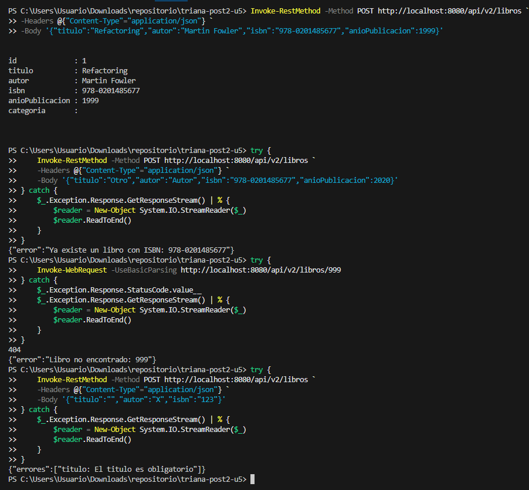
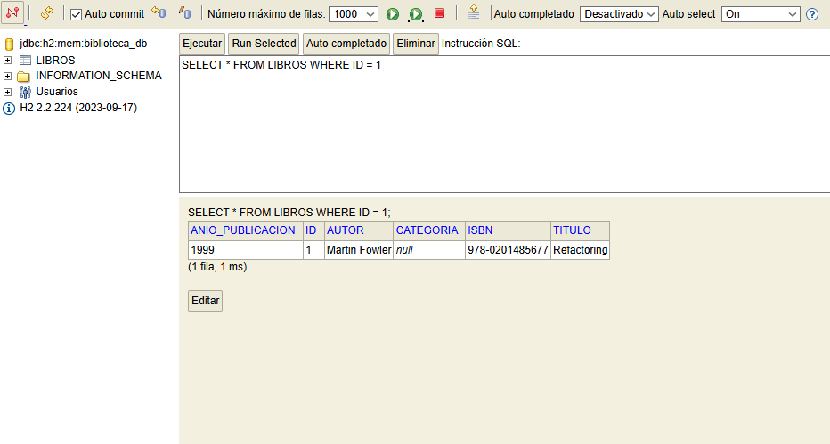

# U5 Post-Contenido 2 - DTOs, Errores Globales y Swagger

## Objetivo
Extender la API REST aplicando DTOs, mapper, manejo global de errores y documentacion OpenAPI/Swagger.

## Tecnologias
- Java 17
- Spring Boot 3.2.x
- Spring Data JPA + H2
- Validation
- SpringDoc OpenAPI

## Ejecutar
```bash
mvn clean spring-boot:run
```

## Endpoints principales
- `GET /api/v2/libros`
- `GET /api/v2/libros/{id}`
- `POST /api/v2/libros`
- `DELETE /api/v2/libros/{id}`

## Casos esperados
- ISBN duplicado: 400
- Validaciones `@Valid`: 400
- ID inexistente: 404

## Documentacion
- Swagger UI: `http://localhost:8080/swagger-ui.html`
- OpenAPI JSON: `http://localhost:8080/api-docs`

## Evidencias de Verificacion 






| Checkpoint | Estado | Evidencia |
|---|---|---|
| Compila sin errores (mvn compile) | PASS | mvn -q -DskipTests compile |
| Aplicacion inicia en puerto de prueba | PASS | http://localhost:18502 |
| POST valido retorna 201 | PASS | status=201 |
| POST ISBN duplicado retorna 400 | PASS | status=400 |
| GET inexistente retorna 404 con error | PASS | status=404 |
| POST invalido (titulo vacio) retorna 400 | PASS | status=400 |
| Swagger UI accesible | PASS | status=200 |


